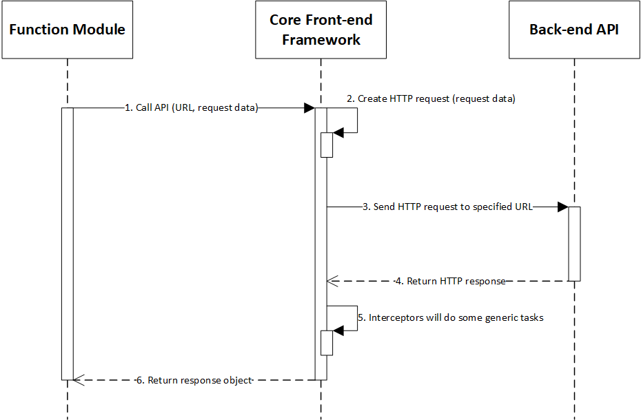

# Client-Server Communication

## Overview

In Thunder Platform, we focus on building applications with Single Page Application (SPA) design in mind. The data exchange between server and client will be standardized as JSON format.

The platform aims to solve the following issues:
- Provides a mechanism for the client-side to communicate with the server-side through REST API (GET, POST, PUT, DELETE).
- Creates HTTP request based on provided parameters. The request information may contain general information on the system that is automatically included without any extra coding effort of developers.
- When receiving response/result from the server, the platform will parse the response data, do some generic tasks (error handling, response formatting) and finally return to the calling method.
- Allows response caching when needed and can be configured.
- The platform will handle HTTP Status Codes automatically. When receiving error status codes, the platform may show error messages.
- The real function module should handle HTTP 200 only.

## Communication Process

The following diagram depicts the process of server communication in the Thunder Platform.

## Interceptors

Interceptors provide a mechanism to intercept and/or mutate outgoing requests or incoming responses. They are very similar to the concept of middleware with a framework like Express, except for the frontend. Interceptors can be really useful for features like caching and logging.

The platform will/may/should support following interceptors:
| **Interceptor**        | **Description**                                                                                                                                                           |
|------------------------|---------------------------------------------------------------------------------------------------------------------------------------------------------------------------|
| AuthInterceptor        | The system will add JWT token \(authentication token\) in the request header when calling backend API automatically if the user was logged in\.                           |
|                        | If the user is not logged in yet, the system will not include the token in the header\.                                                                                   |
| AntiForgeryInterceptor | The system will add Request Verification Token \(X\-XSRF\-Token\) in the request header to prevent XSRF \(Cross\-site request forgery\) attack\.                          |
| SessionInterceptor     | The system will add session information of the user in the request header or session id \(in case there are too much information that can not be stored in the header\)\. |
| LoggingInterceptor     | The system will write log information when receiving responses from the server including: request URL, parameter, header, process time\.                                  |
| HttpErrorInterceptor   | The system will display general message if HTTP Status code != 200                                                                                                        |
| ResponseInterceptor    | The system will read response body, convert to HttpResponse object to return back to the calling method                                                                   |

## Common Request Headers

The platform will/may/should contains following request headers:

| **Header**                 | **Description**                                  |
|----------------------------|--------------------------------------------------|
| Thunder-Session-Info       | Contains session information with base64 encoded |
| Thunder-STS-Authentication | JWT Token                                        |

FYI: The "Thunder" prefix is to indicate that this header is specified for the platform only (<https://specs.openstack.org/openstack/api-wg/guidelines/headers.html>).

